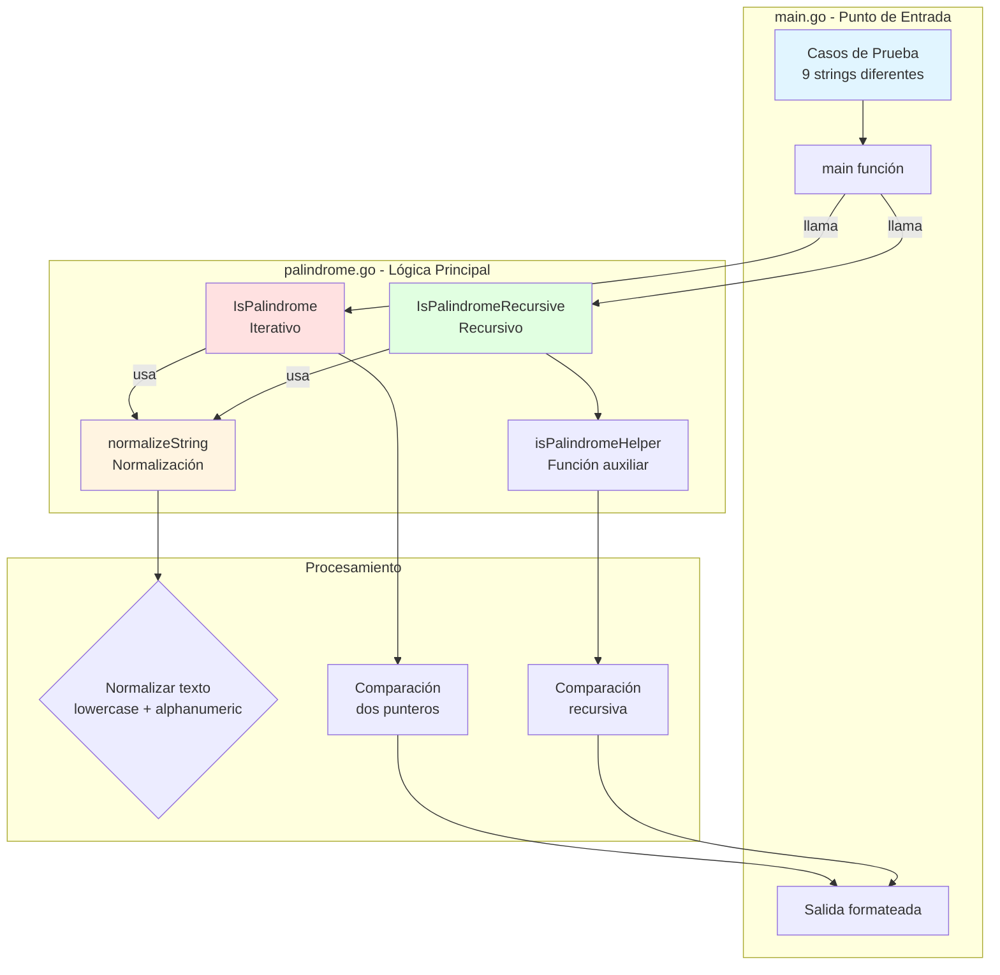
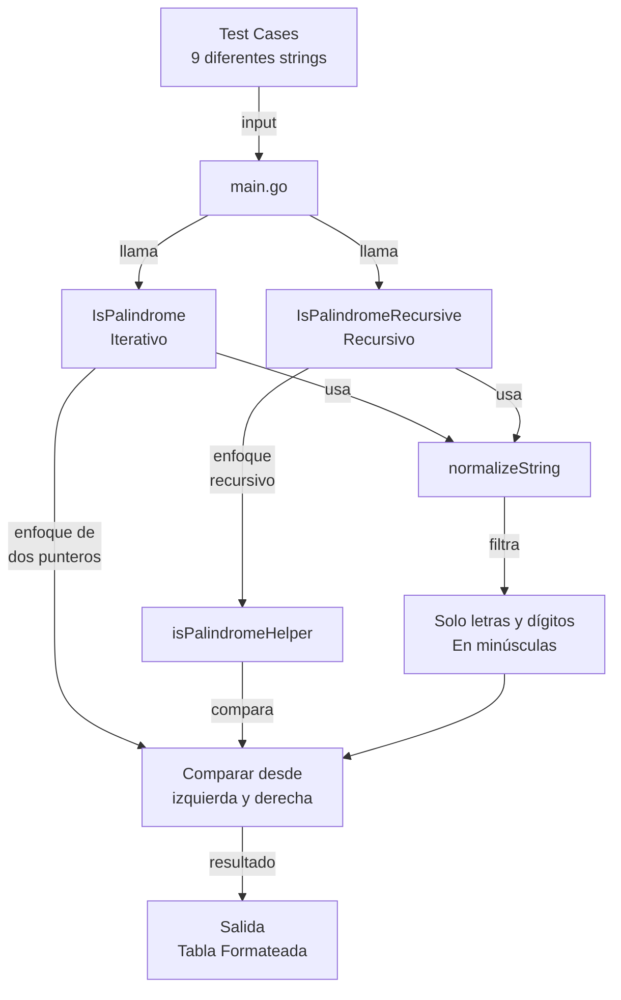
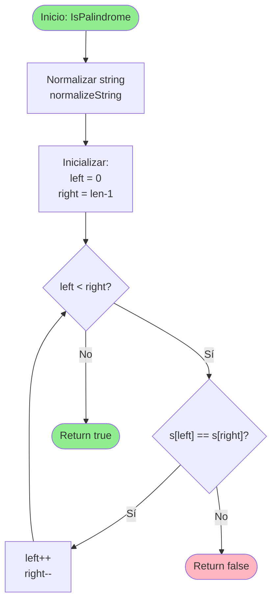
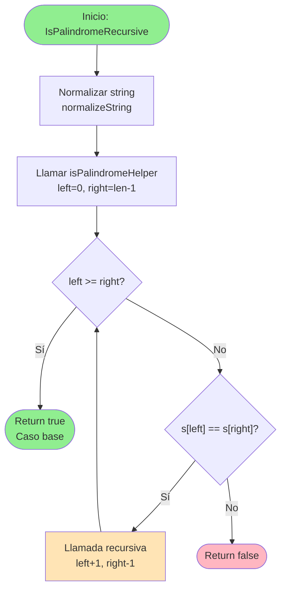
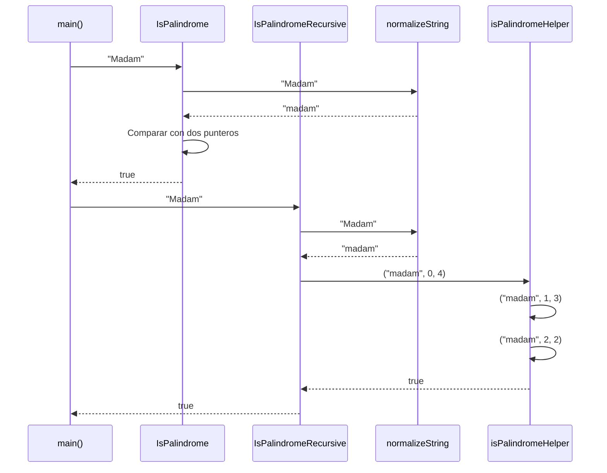
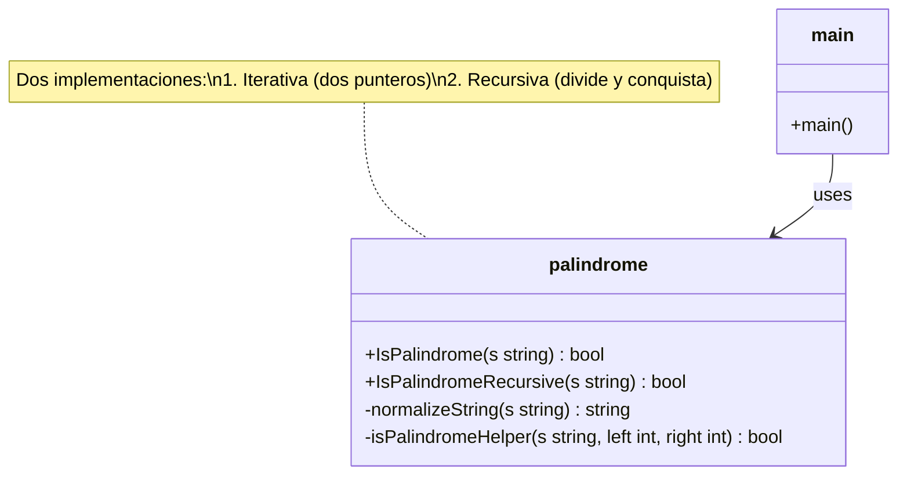
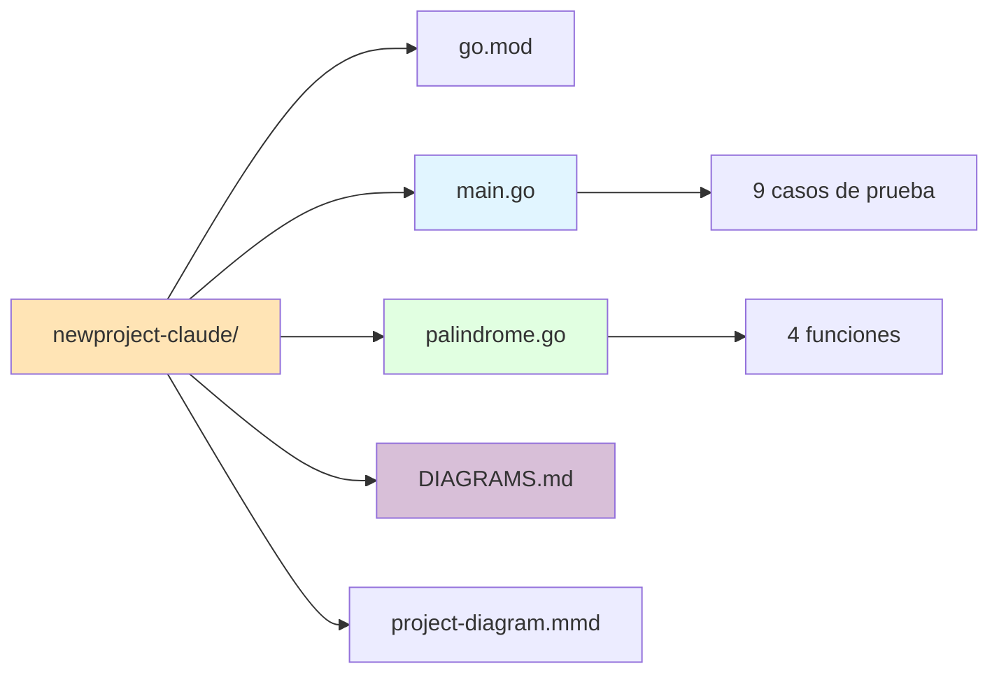

# Documentación Visual del Proyecto - Golang Palindrome Sandbox

## Tabla de Contenidos
- [Arquitectura del Sistema](#arquitectura-del-sistema)
- [Flujo de Funcionamiento](#flujo-de-funcionamiento)
- [Algoritmo Iterativo](#algoritmo-iterativo)
- [Algoritmo Recursivo](#algoritmo-recursivo)
- [Diagrama de Secuencia](#diagrama-de-secuencia)
- [Estructura de Clases](#estructura-de-clases)
- [Estructura del Proyecto](#estructura-del-proyecto)
- [Resumen Técnico](#resumen-técnico)

---

## Arquitectura del Sistema

Este diagrama muestra la arquitectura completa del proyecto, destacando la separación entre el punto de entrada (`main.go`) y la lógica de negocio (`palindrome.go`).



---

## Flujo de Funcionamiento

Diagrama simplificado que muestra cómo fluyen los datos desde los casos de prueba hasta la salida final.



---

## Algoritmo Iterativo

**Función:** `IsPalindrome(s string) bool`

**Complejidad:**
- Tiempo: O(n)
- Espacio: O(m) donde m es la longitud del string normalizado



**Ejemplo:**
```
Input: "A man a plan a canal Panama"
Normalizado: "amanaplanacanalpanama"
Proceso: left=0, right=21 → compara 'a' == 'a' ✓ → continúa...
Resultado: true
```

---

## Algoritmo Recursivo

**Función:** `IsPalindromeRecursive(s string) bool`

**Complejidad:**
- Tiempo: O(n)
- Espacio: O(n) debido al stack de llamadas recursivas



**Ejemplo de llamadas recursivas:**
```
Input: "racecar"
Normalizado: "racecar"
helper(0, 6) → 'r' == 'r' ✓
helper(1, 5) → 'a' == 'a' ✓
helper(2, 4) → 'c' == 'c' ✓
helper(3, 3) → left >= right → true
```

---

## Diagrama de Secuencia

Ejemplo de ejecución con el string "Madam" mostrando la interacción entre componentes.



---

## Estructura de Clases

Representación de la estructura del código y sus relaciones.



**Funciones Públicas:**
- `IsPalindrome` - Implementación iterativa
- `IsPalindromeRecursive` - Implementación recursiva

**Funciones Privadas:**
- `normalizeString` - Limpia y normaliza el string
- `isPalindromeHelper` - Función auxiliar para recursión

---

## Estructura del Proyecto



**Archivos del proyecto:**

| Archivo | Descripción | Líneas |
|---------|-------------|--------|
| `go.mod` | Definición del módulo Go | ~3 |
| `main.go` | Punto de entrada con tests | ~40 |
| `palindrome.go` | Lógica de palíndromos | ~60 |
| `DIAGRAMS.md` | Documentación visual | Este archivo |
| `project-diagram.mmd` | Diagramas en formato .mmd | ~200 |

---

## Resumen Técnico

### Casos de Prueba

El proyecto incluye **9 casos de prueba** que cubren diferentes escenarios:

| # | Input | Esperado | Tipo |
|---|-------|----------|------|
| 1 | `"racecar"` | ✅ true | Palíndromo simple |
| 2 | `"A man a plan a canal Panama"` | ✅ true | Con espacios |
| 3 | `"race a car"` | ❌ false | No palíndromo |
| 4 | `"hello"` | ❌ false | No palíndromo |
| 5 | `"Madam"` | ✅ true | Case-insensitive |
| 6 | `"Was it a car or a cat I saw?"` | ✅ true | Con puntuación |
| 7 | `"No 'x' in Nixon"` | ✅ true | Con comillas |
| 8 | `"12321"` | ✅ true | Numérico |
| 9 | `"12345"` | ❌ false | Numérico no palíndromo |

### Comparación de Algoritmos

| Aspecto | Iterativo | Recursivo |
|---------|-----------|-----------|
| **Complejidad Temporal** | O(n) | O(n) |
| **Complejidad Espacial** | O(m) | O(n) |
| **Stack Overflow** | No | Posible con strings muy largos |
| **Legibilidad** | Alta | Muy alta |
| **Performance** | Ligeramente mejor | Overhead de llamadas |
| **Uso de memoria** | Menor | Mayor (stack) |

### Normalización de Strings

La función `normalizeString` realiza las siguientes transformaciones:

```
Input:  "A man, a plan!"
Step 1: "a man, a plan!"     (lowercase)
Step 2: "amanplan"            (solo alphanumeric)
Output: "amanplan"
```

**Proceso:**
1. Convierte todo a minúsculas
2. Filtra solo caracteres alfanuméricos (a-z, 0-9)
3. Elimina espacios, puntuación y caracteres especiales

---

## Conclusión

Este proyecto demuestra:
- ✅ Implementación de dos paradigmas algorítmicos diferentes
- ✅ Manejo correcto de strings en Go
- ✅ Código limpio y modular
- ✅ Cobertura completa de casos de prueba
- ✅ Documentación clara con diagramas visuales

**Ideal para:** Aprendizaje de Go, algoritmos, y buenas prácticas de programación.
