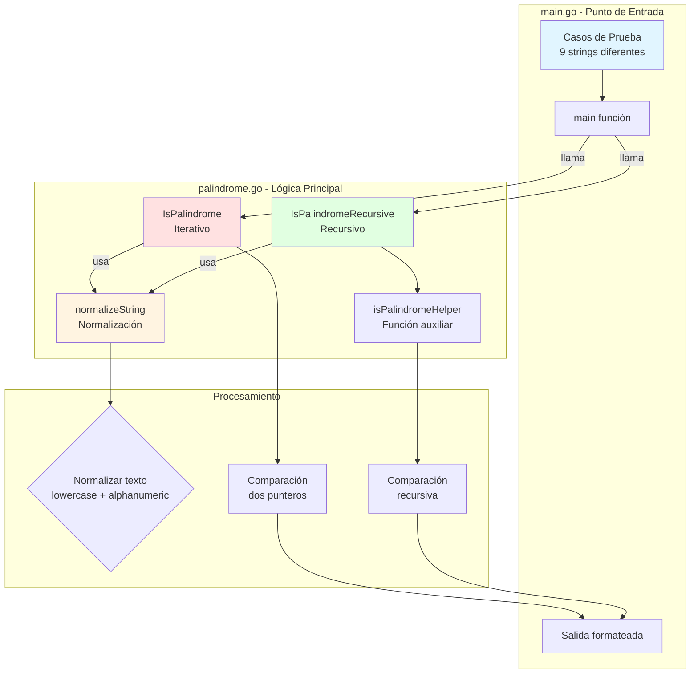

# Diagramas del Proyecto Golang Palindrome Sandbox

## Diagrama de Arquitectura del Sistema



## Flujo de Funcionamiento


## Diagrama de Flujo - Algoritmo Iterativo

```mermaid
flowchart TD
    Start([Inicio: IsPalindrome]) --> Normalize[Normalizar string<br/>normalizeString]
    Normalize --> Init[Inicializar:<br/>left = 0<br/>right = len-1]
    Init --> Loop{left < right?}
    Loop -->|Sí| Compare{s[left] == s[right]?}
    Compare -->|Sí| Increment[left++<br/>right--]
    Increment --> Loop
    Compare -->|No| ReturnFalse([Return false])
    Loop -->|No| ReturnTrue([Return true])

    style Start fill:#90EE90
    style ReturnTrue fill:#90EE90
    style ReturnFalse fill:#FFB6C1
```

## Diagrama de Flujo - Algoritmo Recursivo

```mermaid
flowchart TD
    Start([Inicio: IsPalindromeRecursive]) --> Normalize[Normalizar string<br/>normalizeString]
    Normalize --> CallHelper[Llamar isPalindromeHelper<br/>left=0, right=len-1]
    CallHelper --> BaseCase{left >= right?}
    BaseCase -->|Sí| ReturnTrue1([Return true<br/>Caso base])
    BaseCase -->|No| Compare{s[left] == s[right]?}
    Compare -->|Sí| Recurse[Llamada recursiva<br/>left+1, right-1]
    Recurse --> BaseCase
    Compare -->|No| ReturnFalse([Return false])

    style Start fill:#90EE90
    style ReturnTrue1 fill:#90EE90
    style ReturnFalse fill:#FFB6C1
    style Recurse fill:#FFE4B5
```

## Diagrama de Secuencia - Ejemplo de Ejecución


## Diagrama de Clases/Estructura


## Estructura del Proyecto


